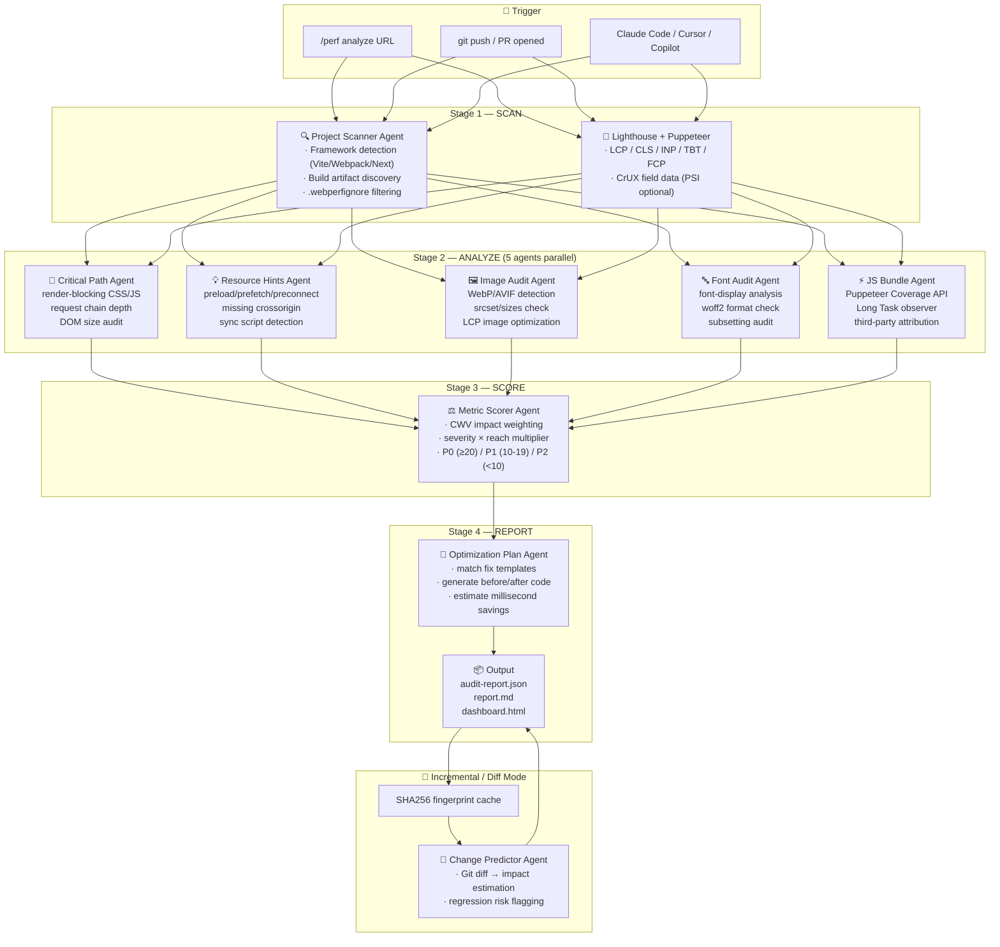

<p align="center">
  <picture>
    <source media="(prefers-color-scheme: dark)" srcset="docs/logo-dark.svg">
    
  </picture>
</p>

<p align="center">
  <a href="https://github.com/EVEDensity/web-perf-audit/stargazers">
    
  </a>
  <a href="https://github.com/EVEDensity/web-perf-audit/blob/main/LICENSE">
    
  </a>
  <a href="https://www.python.org/downloads/">
    
  </a>
  <a href="https://nodejs.org/">
    
  </a>
  <a href="https://claude.ai/code">
    
  </a>
  <br>
  <a href="https://github.com/EVEDensity/web-perf-audit/actions">
    
  </a>
  <a href="#">
    
  </a>
  <a href="#">
    
  </a>
  <a href="#">
    
  </a>
</p>

<h1 align="center">web-perf-audit</h1>

<p align="center">
  📖 <b>English</b>&nbsp;·&nbsp;
  <a href="README_zh-CN.md">简体中文</a>&nbsp;·&nbsp;
  <a href="README_zh-TW.md">繁體中文</a>&nbsp;·&nbsp;
  <a href="README_ja.md">日本語</a>&nbsp;·&nbsp;
  <a href="README_ko.md">한국어</a>&nbsp;·&nbsp;
  <a href="README_es.md">Español</a>&nbsp;·&nbsp;
  <a href="README_tr.md">Türkçe</a>&nbsp;·&nbsp;
  <a href="README_ru.md">Русский</a>
</p>

<p align="center">
  <strong>Fixes that ship > advice that sits in a dashboard.</strong><br>
  Multi-Agent Web Performance Audit Pipeline — SCAN → ANALYZE → SCORE → REPORT.<br>
  Not another Lighthouse wrapper. A complete audit-to-fix workflow with CWV impact estimates.<br>
  Works with <strong>Claude Code, Cursor, VSCode Copilot,</strong> and any CI pipeline.
</p>

<p align="center">
  
</p>

<p align="center">
  <code>npx web-perf-audit --url https://example.com --audience dev</code>
</p>

---

## Why web-perf-audit

You run Lighthouse. It says LCP 4.2s, score 62. You stare at the screen. Now what?

Every tool tells you **what's wrong**. None of them tell you **what to change, line by line, and why that specific change will work**. web-perf-audit fills that gap — it runs a multi-agent pipeline that:

- **Scans** your page with Lighthouse + Puppeteer for raw CWV metrics
- **Analyzes** across 5 dimensions in parallel (rendering path, resource hints, images, fonts, JS bundles)
- **Scores** every finding against its real Core Web Vitals impact (not discovery order)
- **Generates** a prioritized report with copy-pasteable fixes, each backlinked to the web.dev principle that explains it

> *"The goal isn't a 100/100 Lighthouse score — it's a page that loads fast and responds instantly for real users."*

---

## ✨ Core Features

<table>
<tr>
<td width="50%">

### 🎯 web.dev Standards-Aligned

Every audit rule traces back to [web.dev/learn/performance](https://web.dev/learn/performance). LCP ≤ 2.5s, INP ≤ 200ms, CLS ≤ 0.1. Not our opinions — Google's thresholds, measured at p75.

</td>
<td width="50%">

### 🤖 Multi-Agent Audit Pipeline

5 specialized agents run in parallel: Project Scanner, Resource Analyzer, Metric Scorer, Change Predictor, and Optimization Planner. Each does one thing well.

</td>
</tr>
<tr>
<td width="50%">

### 🔧 Deterministic + Measured Hybrid

Static checks (missing `defer`, wrong `font-display`, absent `srcset`) are deterministic — same page, same result. Runtime metrics (LCP, TBT) come from real browser measurement via Lighthouse + Puppeteer.

</td>
<td width="50%">

### 📊 Offline Dashboard

Interactive Chart.js dashboard with score ring, CWV cards, category breakdown, and priority-ordered issue list. Works entirely offline — no external API calls after audit.

</td>
</tr>
<tr>
<td width="50%">

### 🔁 Incremental Git-Aware Audits

SHA256 fingerprint caching skips unchanged pages. `perf-diff` compares two audits across branches — catch performance regressions before they merge, not after.

</td>
<td width="50%">

### 🧩 Cross-Platform & Multi-IDE

Runs on macOS / Linux / Windows. Native Claude Code skill, plus Cursor rules, VSCode Copilot instructions. One-liner CI integration for GitHub Actions, GitLab CI, Jenkins.

</td>
</tr>
</table>

---

## 🏗 Architecture

### Multi-Agent Audit Pipeline



### Layered Design

| Layer | Responsibility | Technology |
|-------|---------------|------------|
| **Trigger** | CLI / CI / IDE invocation | Claude Code Skill, GitHub Actions, Cursor rules |
| **Scan** | Raw data collection + project discovery | Lighthouse CLI, Puppeteer, PageSpeed Insights API |
| **Analyze** | 5-dimension static + runtime analysis | Python 3.8+ (HTMLParser, urllib), Node.js (Puppeteer) |
| **Score** | CWV-weighted priority calculation | Python scoring engine (7-category × severity multipliers) |
| **Generate** | Report rendering + fix templating | Python (Markdown/JSON), Chart.js (dashboard HTML) |
| **Diff** | Incremental caching + cross-branch comparison | SHA256 fingerprinting, JSON structural diff |

### How we adapted Understand-Anything's pipeline

[Understand-Anything](https://github.com/Egonex-AI/Understand-Anything) pioneered the multi-agent code analysis pipeline — `project-scanner → file-analyzer → architecture-analyzer → tour-builder → graph-reviewer`. We adapted this pattern for web performance:

| Understand-Anything | web-perf-audit | Adaptation |
|---------------------|----------------|------------|
| `project-scanner` (language/framework detection) | `Project Scanner Agent` (build tool detection, .webperfignore) | Code structure → page structure |
| `file-analyzer` (function/class extraction) | `Resource Analyzer Agent` (HTML/CSS/JS static audit) | AST nodes → DOM + CSSOM nodes |
| `architecture-analyzer` (layer tagging) | `Metric Scorer Agent` (CWV impact scoring) | Architecture layers → performance dimensions |
| `tour-builder` (guided walkthrough) | `Optimization Plan Agent` (fix generation) | Code tour → fix checklist |
| `graph-reviewer` (integrity check) | `Change Predictor Agent` (regression detection) | Schema validation → performance regression |

---

## 🚀 Quick Start

### 4 steps from zero to audit report

```bash
# 1. Clone
git clone https://github.com/EVEDensity/web-perf-audit.git && cd web-perf-audit

# 2. Install dependencies
npm install -g lighthouse && npm install

# 3. Run your first audit
python scripts/fetch_metrics.py "https://example.com" --output-dir .web-perf
python scripts/analyze_critical_path.py .web-perf/metrics.json -o .web-perf/critical-path.json &
python scripts/check_resource_hints.py "https://example.com" -o .web-perf/resource-hints.json &
python scripts/audit_images.py "https://example.com" -o .web-perf/images.json &
python scripts/audit_fonts.py "https://example.com" -o .web-perf/fonts.json &
node scripts/audit_js_bundles.js "https://example.com" --output .web-perf/js-bundles.json &
wait
python scripts/score_and_report.py "https://example.com" --output-dir .web-perf --format all

# 4. Open the dashboard
open .web-perf/dashboard.html   # macOS
start .web-perf/dashboard.html  # Windows
xdg-open .web-perf/dashboard.html  # Linux
```

### Or use the one-liner (Claude Code)

```
/plugin install web-perf-audit@EVEDensity/web-perf-audit
/perf analyze https://example.com
```

---

## 📦 Installation

### macOS / Linux

```bash
# One-shot install
curl -fsSL https://raw.githubusercontent.com/EVEDensity/web-perf-audit/main/install.sh | bash

# Or step by step
git clone https://github.com/EVEDensity/web-perf-audit.git ~/.web-perf-audit
cd ~/.web-perf-audit
npm install -g lighthouse
npm install
echo 'alias perf-audit="python ~/.web-perf-audit/scripts/fetch_metrics.py"' >> ~/.bashrc
```

### Windows (PowerShell)

```powershell
# One-shot install
iwr -Uri https://raw.githubusercontent.com/EVEDensity/web-perf-audit/main/install.ps1 -OutFile install.ps1; ./install.ps1

# Or step by step
git clone https://github.com/EVEDensity/web-perf-audit.git $env:USERPROFILE\.web-perf-audit
cd $env:USERPROFILE\.web-perf-audit
npm install -g lighthouse
npm install
```

### IDE Plugin Setup

| IDE | How to enable |
|-----|--------------|
| **Claude Code** | `/plugin install web-perf-audit@EVEDensity/web-perf-audit` |
| **Cursor** | Add `.cursorrules`: `@web-perf-audit analyze on save` |
| **VSCode Copilot** | Add to `.github/copilot-instructions.md`: `Use web-perf-audit for performance reviews` |
| **Codex / Gemini CLI** | Copy `SKILL.md` to your skills directory |

### Prerequisites

| Dependency | Version | Required For |
|-----------|---------|-------------|
| Python | ≥ 3.8 | All analysis + scoring scripts |
| Node.js | ≥ 18 | Lighthouse CLI + Puppeteer (JS audit) |
| Lighthouse | latest (`npm i -g lighthouse`) | CWV metric collection |
| Puppeteer | ^22.0.0 (`npm i puppeteer`) | JS Coverage + Long Task API |

---

## 📖 CLI Command Reference

All commands follow the `/perf` namespace. Each entry shows: purpose, example, flags, and output.

### `/perf analyze` — Full Audit

Run the complete SCAN → ANALYZE → SCORE → REPORT pipeline against a URL.

```bash
python scripts/fetch_metrics.py <URL> --output-dir .web-perf
# ... (5 parallel analyzers) ...
python scripts/score_and_report.py <URL> --output-dir .web-perf --audience dev --format all
```

| Flag | Default | Description |
|------|---------|-------------|
| `--output-dir` | `.web-perf` | Where to write output files |
| `--audience` | `dev` | `dev` (full + code fixes) or `pm` (summary + scores only) |
| `--format` | `all` | `json`, `markdown`, `html`, or `all` |
| `--strategy` | `mobile` | Lighthouse emulation: `mobile` or `desktop` |
| `--psi-key` | — | PageSpeed Insights API key (for CrUX field data) |
| `--extra-lighthouse-flags` | — | Pass additional flags to Lighthouse CLI |

**Output:** `.web-perf/audit-report.json`, `report.md`, `dashboard.html`

---

### `/perf dashboard` — Visual Dashboard

Launch the interactive Chart.js dashboard without re-running the audit.

```bash
# Opens .web-perf/dashboard.html in your browser
open .web-perf/dashboard.html

# Or serve via HTTP for remote access
python -m http.server 8080 -d .web-perf
# Then open http://localhost:8080/dashboard.html
```

The dashboard includes:
- Score ring (color-coded A→F)
- CWV metric cards with good/needs-improvement/poor badges
- Category breakdown bar chart (7 dimensions)
- P0/P1/P2 issue list with fix snippets
- vs-previous-audit comparison panel (automatic if fingerprint exists)

---

### `/perf diff` — Git Change Impact

Compare two audit reports to catch performance regressions before they merge.

```bash
# Compare two audit snapshots
python scripts/diff_report.py \
  .web-perf/before/audit-report.json \
  .web-perf/after/audit-report.json \
  --format both \
  -o .web-perf/diff-report.json
```

**Output:** `diff-report.json` (structured) + `diff-report.md` (human-readable) with:
- Per-metric delta (LCP: 3200→4100ms ❌)
- Category score changes (JS: 72→58 ❌)
- Resolved issues (✅ 3 fixed) vs new issues (⚠️ 2 introduced)
- Regression severity: 🔴 critical / 🟡 warning / 🟢 improvement

**CI integration example:**

```yaml
# .github/workflows/perf-diff.yml
name: Performance Diff
on: [pull_request]
jobs:
  perf-diff:
    runs-on: ubuntu-latest
    steps:
      - uses: actions/checkout@v4
        with:
          fetch-depth: 0
      - name: Audit base branch
        run: |
          git checkout ${{ github.base_ref }}
          python scripts/fetch_metrics.py "$STAGING_URL" --output-dir .web-perf/before
      - name: Audit PR branch
        run: |
          git checkout ${{ github.head_ref }}
          python scripts/fetch_metrics.py "$STAGING_URL" --output-dir .web-perf/after
      - name: Diff & Comment
        run: |
          python scripts/diff_report.py \
            .web-perf/before/audit-report.json \
            .web-perf/after/audit-report.json \
            --format markdown -o .web-perf/diff-report.md
          gh pr comment ${{ github.event.pull_request.number }} --body-file .web-perf/diff-report.md
```

---

### `/perf explain` — Single File Deep Dive

Analyze one HTML/CSS/JS file in isolation. Useful for debugging a specific component or template.

```bash
python scripts/check_resource_hints.py <URL> -o .web-perf/resource-hints.json
# Then read the per-file breakdown in audit-report.json
```

---

### `/perf resource` — Static Resource Batch Audit

Audit all images, fonts, and third-party scripts referenced by a page without running Lighthouse.

```bash
# Run only the static analysis scripts (no browser needed)
python scripts/audit_images.py "https://example.com" -o .web-perf/images.json
python scripts/audit_fonts.py "https://example.com" -o .web-perf/fonts.json
```

Use when:
- You're iterating on image/asset changes and want fast feedback
- Running in a headless CI environment without a display
- Quick pre-flight before a full audit

---

### `/perf chat` — Conversational Performance Consulting

Ask natural-language questions about your audit results (Claude Code native).

> *"Why is my LCP so high?"*
> *"Which of these P0 issues should I fix first?"*
> *"What's the estimated LCP improvement if I implement all image fixes?"*

The Claude Code skill reads your latest `audit-report.json` and answers with context from the 8 web.dev reference modules.

---

## 💼 Real-World Use Cases

### 1. Local Frontend Project Audit

```bash
# Start your dev server
npm run dev &

# Audit the local build
python scripts/fetch_metrics.py "http://localhost:5173" --output-dir .web-perf
# ... (5 parallel analyzers) ...
python scripts/score_and_report.py "http://localhost:5173" --output-dir .web-perf --audience dev --format all
```

Typical findings on first run:
- 3-8 render-blocking resources to defer or inline
- 40-60% unused JavaScript (Coverage API)
- Missing `width`/`height` on hero images (CLS impact)
- `font-display: swap` not set on custom fonts

### 2. CI/CD Performance Gate

```yaml
# .github/workflows/perf-gate.yml
name: Performance Gate
on: [push]
jobs:
  gate:
    runs-on: ubuntu-latest
    steps:
      - uses: actions/checkout@v4
      - name: Full Audit
        run: |
          npm install -g lighthouse && npm install
          URL="https://staging.example.com"
          OUT=".web-perf"
          python scripts/fetch_metrics.py "$URL" --output-dir "$OUT"
          for script in analyze_critical_path.py check_resource_hints.py audit_images.py audit_fonts.py; do
            python "scripts/$script" "$URL" -o "$OUT/$(basename $script .py).json" &
          done
          node scripts/audit_js_bundles.js "$URL" --output "$OUT/js-bundles.json" &
          wait
          python scripts/score_and_report.py "$URL" --output-dir "$OUT" --format all
      - name: Check Thresholds
        run: |
          # Fail if overall score < 70
          SCORE=$(python -c "import json; print(json.load(open('.web-perf/audit-report.json'))['overallScore']['overallScore'])")
          if [ "$SCORE" -lt 70 ]; then echo "Score $SCORE < 70 — failing gate"; exit 1; fi
```

### 3. Git post-commit Incremental Scan

```bash
# .git/hooks/post-commit (add this to your repo)
#!/bin/bash
PREV_FINGERPRINT=$(cat .web-perf/fingerprint.txt 2>/dev/null || echo "")

python scripts/fetch_metrics.py "http://localhost:5173" --output-dir .web-perf
# ... (parallel analyzers) ...
python scripts/score_and_report.py "http://localhost:5173" --output-dir .web-perf --format json

CURR_FINGERPRINT=$(cat .web-perf/fingerprint.txt)
if [ "$PREV_FINGERPRINT" != "$CURR_FINGERPRINT" ] && [ -n "$PREV_FINGERPRINT" ]; then
  echo "⚠️  Performance profile changed. Check .web-perf/dashboard.html"
fi
```

### 4. AgentHub Official Plugin Integration

web-perf-audit is designed as a first-class [AgentHub](https://github.com/EVEDensity/AgentHub) plugin:

```json
// AgentHub plugin registry entry
{
  "name": "web-perf-audit",
  "type": "official-plugin",
  "repo": "EVEDensity/web-perf-audit",
  "entry": "SKILL.md",
  "commands": ["perf-analyze", "perf-dashboard", "perf-diff"],
  "category": "performance",
  "requires": ["python>=3.8", "node>=18", "lighthouse"]
}
```

Once registered, AgentHub users can install it with a single command and run performance audits across all their projects.

---

## 🔧 Extension Development

### Add a Custom Audit Rule

1. Create a new rule file in `rules/`:

```python
# rules/custom_security_headers.py
def audit_security_headers(url, html_content):
    """
    Check for performance-relevant security headers.
    Returns: list of issue dicts with {type, description, severity, fix, ref}
    """
    issues = []
    # Your detection logic here
    return issues
```

2. Register it in `score_and_report.py`:

```python
# In score_and_report.py, add to the analyzer registry
from rules.custom_security_headers import audit_security_headers
ANALYZERS['securityHeaders'] = audit_security_headers
```

3. Assign a weight (if it should affect the overall score):

```python
WEIGHTS['securityHeaders'] = 0.03  # 3% of total score
```

### Build a Custom Agent

Agents follow a standard interface — input JSON, output JSON + text:

```python
# agents/my_agent.py
def analyze(input_data: dict) -> dict:
    """
    Args:
        input_data: {"url": str, "html": str, "metrics": dict}
    Returns:
        {"issues": [...], "score": float, "summary": str}
    """
    # Your agent logic
    return {"issues": [], "score": 100.0, "summary": ""}

if __name__ == "__main__":
    import sys, json
    data = json.loads(sys.stdin.read())
    result = analyze(data)
    print(json.dumps(result, indent=2))
```

Wire it into `score_and_report.py`'s agent registry, and it runs in parallel with the built-in agents.

### Customize the Dashboard

`templates/dashboard.html` uses Chart.js and CSS custom properties:

```css
/* Override in your own build */
:root {
  --bg: #0f172a;           /* Dark background */
  --card-bg: #1e293b;      /* Card surface */
  --green: #22c55e;        /* Good score */
  --yellow: #eab308;       /* Needs improvement */
  --red: #ef4444;          /* Poor */
  --blue: #3b82f6;         /* Accent */
}
```

Change the 6 CSS variables for your brand. The Chart.js config is in `render()` — swap bar charts for radar, add trend lines, whatever fits.

### Local LLM Integration (Ollama / vLLM)

For air-gapped or private deployments, swap the scoring LLM:

```python
# In score_and_report.py, replace the LLM call
import requests

def score_with_local_llm(issue):
    resp = requests.post("http://localhost:11434/api/generate", json={
        "model": "llama3.1",
        "prompt": f"Rate this performance issue's severity (1-10): {issue['description']}",
        "stream": False
    })
    return resp.json()["response"]

# Replace the default `estimate_severity()` call
severity = score_with_local_llm(issue)
```

For vLLM, change the endpoint to `http://localhost:8000/v1/completions`.

---

## ❓ FAQ

<details>
<summary><strong>How is this different from running Lighthouse?</strong></summary>

Lighthouse gives you a score and an audit list. web-perf-audit:
- Runs Lighthouse as **stage 1** (data collection) only
- Then runs **5 additional analysis passes** Lighthouse doesn't do: resource hint quality scoring, font `@font-face` rule parsing, real JS Coverage via Puppeteer, third-party attribution, DOM depth audit
- **Scores and prioritizes** all findings against CWV impact — not Lighthouse's "opportunity" order
- Produces **structured JSON** for CI, not just a web UI
- Supports **incremental diff** between two audits for PR gating
- Every fix backlinks to a **web.dev knowledge module** explaining *why*
</details>

<details>
<summary><strong>How long does a full audit take?</strong></summary>

30–90 seconds for a typical page. Breakdown:
- Lighthouse: 15–40s (depends on page complexity + network)
- 5 parallel analyzers: 10–30s (dominated by Puppeteer Coverage API)
- Scoring + report generation: < 1s

For CI, consider caching the Lighthouse run or using PSI API (faster, no browser overhead).
</details>

<details>
<summary><strong>Why is the audit report so large?</strong></summary>

The JSON report includes per-file breakdowns from the JS Coverage audit — if your page loads 200+ JS chunks, the unused-bytes-per-file list adds up. Use `.webperfignore` to exclude third-party resources you can't control (analytics, ads, chat widgets). The Markdown report is filtered to P0/P1 issues only and is usually < 50KB.
</details>

<details>
<summary><strong>I get "permission denied" on install.sh</strong></summary>

```bash
chmod +x install.sh && ./install.sh
```

Or run it through bash directly: `bash install.sh`
</details>

<details>
<summary><strong>The metrics seem off — LCP is reported lower than I see in DevTools</strong></summary>

Lighthouse uses simulated throttling by default (4x CPU slowdown, 1.6 Mbps network). This is intentional — it reflects median mobile users. To match your DevTools experience, pass `--strategy desktop --extra-lighthouse-flags "--throttling-method=provided"`.
</details>

<details>
<summary><strong>Does this work with SPAs? (React / Vue / Svelte)</strong></summary>

Yes. The Puppeteer-based JS audit waits for `networkidle2` before collecting Coverage data, so dynamically loaded chunks are captured. For fully client-rendered apps:
- Use `--strategy desktop` if that matches your user base
- Set `--extra-lighthouse-flags "--preset=desktop"` for realistic LCP
- The static analyzers work on the **server-rendered HTML** — for SPA shell pages, the DOM-based audits (images, hints) may be limited. Use the JS Coverage audit as your primary signal.
</details>

<details>
<summary><strong>Can I run this on a private/intranet site?</strong></summary>

Yes. Lighthouse supports `http://localhost:*` and internal IPs. For self-signed certificates:

```bash
python scripts/fetch_metrics.py "https://internal.company.com" \
  --extra-lighthouse-flags "--chrome-flags='--ignore-certificate-errors'"
```
</details>

<details>
<summary><strong>How do I share the dashboard with my team?</strong></summary>

Three options:
1. **Static HTML**: `.web-perf/dashboard.html` is self-contained — upload to any static host (S3, Netlify, GitHub Pages)
2. **CI artifact**: Upload `.web-perf/` as a build artifact — teammates download and open locally
3. **GitHub Pages**: Push `dashboard.html` to `gh-pages` branch with a data embed
</details>

<details>
<summary><strong>Can I plug in a private LLM?</strong></summary>

Yes. See [Extension Development → Local LLM Integration](#local-llm-integration-ollama--vllm). The scoring engine's severity estimation is the only part that benefits from an LLM — everything else is deterministic. Replace the `estimate_severity()` function with your Ollama/vLLM/OpenAI-compatible endpoint.
</details>

<details>
<summary><strong>What's the difference between PSI and local Lighthouse?</strong></summary>

| | Lighthouse CLI | PageSpeed Insights API |
|---|---|---|
| **Data source** | Simulated lab data | CrUX real-user field data + lab |
| **Speed** | 15-40s | 5-10s |
| **API key** | Not required | Required (free tier: 25k/day) |
| **Accuracy** | Lab — consistent, reproducible | Field — real user experience |
| **Offline** | ✅ | ❌ (needs network) |

Use PSI for production monitoring (real-user p75 data). Use Lighthouse CLI for local dev and CI (no rate limits, offline-capable).
</details>

---

## 🤝 Community & Contributing

### How to Contribute

1. **New audit rule** — add a `.md` to `references/` following the problem → detect → fix → benefit template, then wire it into the relevant analyzer script
2. **New agent** — create a script in `scripts/` (Python or Node.js), produce JSON output, register it in `score_and_report.py`
3. **Dashboard improvements** — edit `templates/dashboard.html`, test with sample JSON
4. **Bug report** — open an issue with your `audit-report.json` and the URL tested

### Issue Template

```
### URL tested
### Expected behavior
### Actual behavior
### audit-report.json snippet
### Lighthouse version (`lighthouse --version`)
### Node.js version (`node --version`)
### Python version (`python --version`)
```

### PR Guidelines

- Keep scripts self-contained — no new dependencies unless absolutely necessary
- Python: standard library preferred, `urllib` for HTTP
- Node: Puppeteer is the only allowed runtime dependency
- All scripts must pass: `python -m py_compile <script>` or `node --check <script>`

### Related Repositories

| Project | Description |
|---------|-------------|
| [AgentHub](https://github.com/EVEDensity/AgentHub) | Multi-agent orchestration platform — web-perf-audit is an official plugin |
| [MineWorld](https://github.com/EVEDensity/MineWorld) | WebGL voxel engine — the performance lessons that inspired this tool |

### GitHub Topics

Add these to your fork or deployment:
`web-performance` `core-web-vitals` `lighthouse` `performance-audit` `web-vitals` `claude-code` `devtools` `pagespeed-insights` `webperf` `performance-budget` `ci-cd` `frontend-engineering`

---

## ⭐ Star History

<p align="center">
  <a href="https://star-history.com/#EVEDensity/web-perf-audit&Date">
    <picture>
      <source media="(prefers-color-scheme: dark)" srcset="https://api.star-history.com/svg?repos=EVEDensity/web-perf-audit&type=Date&theme=dark">
      
    </picture>
  </a>
</p>

---

## 📄 License

MIT © 2026 [EVEDensity](https://github.com/EVEDensity)

<p align="center">
  Built on <a href="https://web.dev/learn/performance">web.dev/learn/performance</a> — the Web Performance curriculum by Google Chrome.<br>
  Pipeline architecture inspired by <a href="https://github.com/Egonex-AI/Understand-Anything">Understand-Anything</a>.<br>
  Part of the <a href="https://github.com/EVEDensity/AgentHub">AgentHub</a> ecosystem.
</p>

---

<p align="center">
  <sub>
    📖 English ·
    <a href="README_zh-CN.md">简体中文</a> ·
    <a href="README_zh-TW.md">繁體中文</a> ·
    <a href="README_ja.md">日本語</a> ·
    <a href="README_ko.md">한국어</a> ·
    <a href="README_es.md">Español</a> ·
    <a href="README_tr.md">Türkçe</a> ·
    <a href="README_ru.md">Русский</a>
  </sub>
</p>
